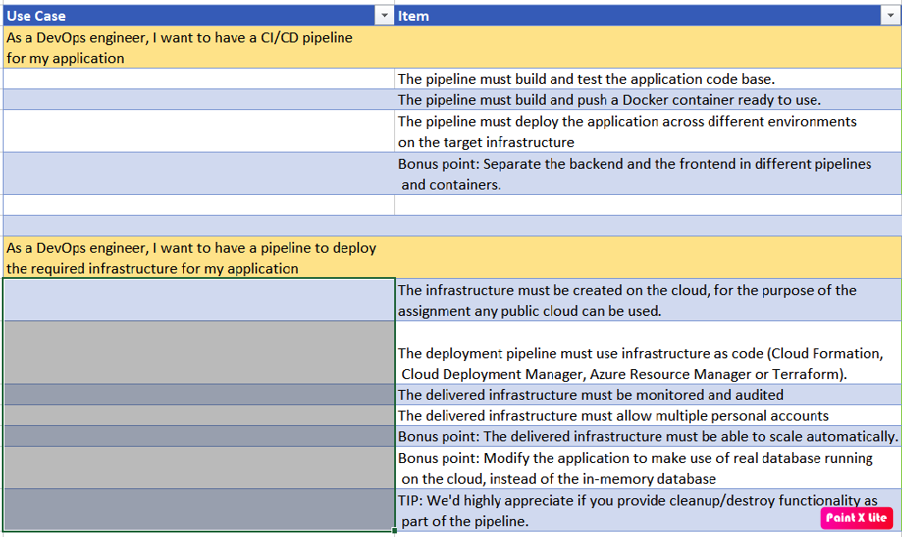

## DevOps Architecture
Implemented the Devops using **GitHub** and **GitHub Actions** which helps to setup **CI/CD** pipeline for Multiple environment. DEV -- > UAT -- > PROD.
Here is overall architecture.

## DevOps Infra Architecture
Terraform is used to create the infra as code. **GitHub** and **GitHub Actions** are for setting up the infra deployment pipeline for Multiple environments. Here is the overall Architecture.

This document helps to understand the End-to-end solution of DevOps Implementation and its scope. The implemented solution is based on the Below use case.

